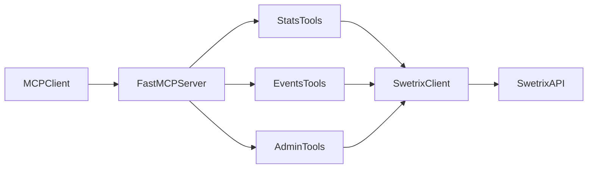

# Architecture

## Flow

## Components

- `src/index.ts`: server startup and tool registration.
- `src/config/env.ts`: validated environment loader.
- `src/http/swetrix-client.ts`: typed HTTP adapter with timeout and normalized errors.
- `src/schemas/common.ts`: reusable `zod` schemas.
- `src/tools/*.ts`: MCP tool definitions by domain.

## Best Practices Applied

- **Schema-first validation**: tool inputs validated before execution.
- **Domain-prefixed tool names**: easier discovery and safer invocation.
- **Read/write hints**: `readOnlyHint`, `destructiveHint`, `idempotentHint`.
- **Secret hygiene**: credentials from `.env`.
- **Error normalization**: consistent and user-safe messages.
- **Deterministic outputs**: tools return stable `{ data: ... }` objects.

## Operational Notes

- Default transport is `stdio` for local MCP clients.
- Optional per-call `apiKey` enables controlled multitenancy.
- Base URL and timeout are configurable for self-hosted Swetrix deployments.

